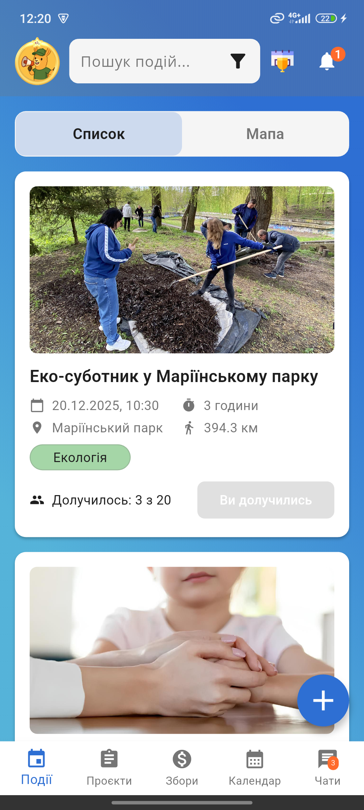
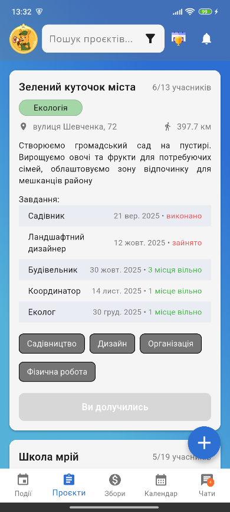
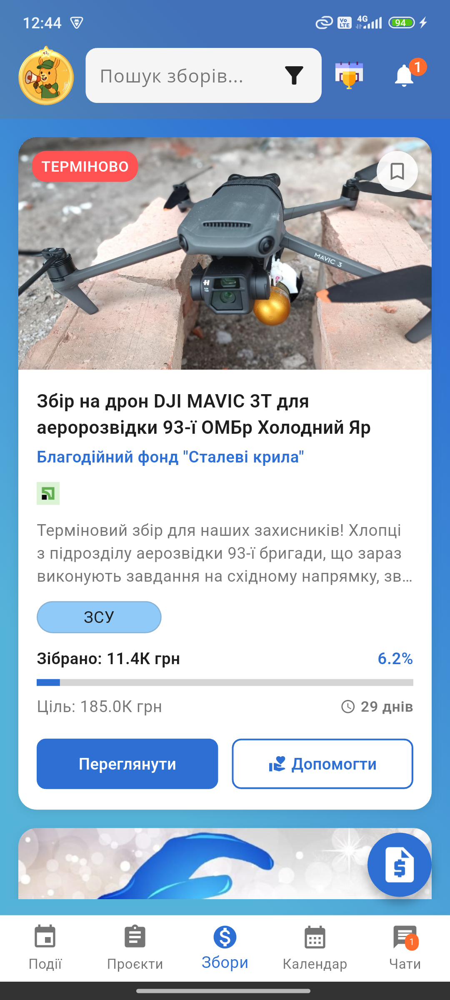
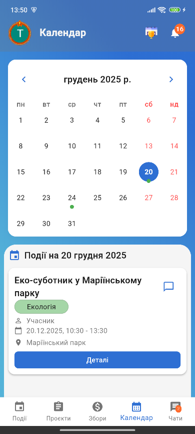
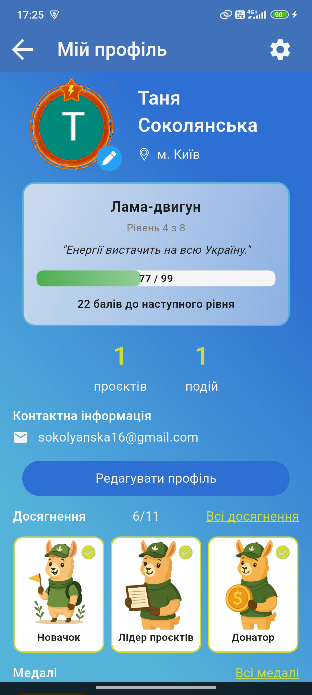

# HelpHub: Integrated Volunteer Platform

A comprehensive mobile platform designed to unify volunteer activities, fundraising, and project management into a single ecosystem.
This project was developed as a **Master's Thesis**.

## Features

### For Volunteers
* **Event Discovery:** Search and filter volunteer events by category and geolocation.
* **Project Management:** Participate in long-term projects with task tracking (Kanban-style) and deadlines.
* **Gamification:** 8-level progression system, achievements, and monthly tournaments to boost motivation.
* **Communication:** Built-in real-time chats (Group, Project, Private).

### For Charity Foundations
* **Fundraising:** Create transparent fundraising campaigns with real-time progress tracking.
* **Reporting:** Publish detailed reports with photos/videos to build trust.
* **Verification:** Validate volunteer applications.

### For Administrators
* **Verification System:** Validate organizations via document checks.
* **Analytics & Support:** Monitor platform activity and handle support tickets.

## Tech Stack

* **Mobile:** Flutter, Dart
* **Architecture:** MVVM, Provider
* **Backend:** Firebase (Authentication, Firestore, Storage, Cloud Functions, Cloud Messaging)
* **Tools:** Git, Android Studio

## Screenshots

|                     Events                      |                     Projects                      |                  Fundraising                   |                     Calendar                      |                 Gamification                  |
|:-----------------------------------------------:|:-------------------------------------------------:|:----------------------------------------------:|:-------------------------------------------------:|:---------------------------------------------:|
|  |  |  |  |  |

---
*Developed by Tetiana - Master of Software Engineering, 2025.*